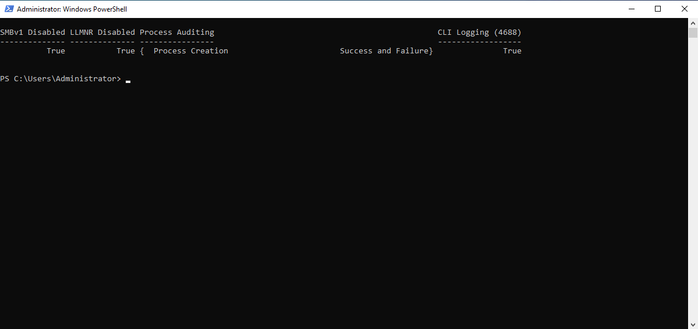

# Phase 2 — Attack Surface Reduction & Audit Telemetry via Code

## Goal

Automate baseline system hardening on the Active Directory Domain Controller (`DC01`) using modular, idempotent PowerShell scripts. Reduce the attack surface by eliminating legacy protocols vulnerable to network poisoning and credential relay, and configure advanced Windows security auditing to capture granular threat telemetry.

## Threat Model & Mitigations

Default Windows Server installations expose services and quiet logging configurations that attackers frequently exploit for initial compromise and privilege escalation:

| Vector | Inherent Risk | Automated Remediation | Threat Mitigated |
|---|---|---|---|
| **SMBv1** | Plaintext dialect, remote code execution vulnerabilities | Disabled optional feature & SMB server configuration | EternalBlue (MS17-010), Pass-the-Hash |
| **NBT-NS & LLMNR** | Broadcast-based fallback name resolution | Set adapter NetBIOS mode to `2` (Disabled); set DNSClient policy `EnableMulticast = 0` | Credential hash capture via Responder |
| **Silent Process Spawning** | Missing process creation arguments in Event Logs | Enforced `Process Creation` auditing & registry CLI string logging | Living-off-the-Land Binaries (LOLBins), unquoted service paths |
| **Identity Attacks** | Unmonitored Kerberos ticket issuance | Enabled auditing for `Kerberos Authentication Service` & `Credential Validation` | AS-REP Roasting, Kerberoasting, password spraying |

## Implementation: Hardening-as-Code

Hardening controls were codified into reusable PowerShell scripts located under `/hardening`:

### 1. Protocol Remediation (`Disable-LegacyProtocols.ps1`)
- **SMBv1 Deprecation:** Invoked `Disable-WindowsOptionalFeature` and `Set-SmbServerConfiguration -EnableSMB1Protocol $false -Force` to prevent legacy SMB exploitation.
- **NetBIOS Termination:** Queried WMI network adapter instances (`Win32_NetworkAdapterConfiguration`) and programmatically invoked `SetTcpipNetbios(2)` across all active interfaces.
- **LLMNR Disablement:** Configured registry path `HKLM:\SOFTWARE\Policies\Microsoft\Windows NT\DNSClient` with `EnableMulticast = 0` to neutralize multicast name resolution broadcasts.

### 2. Advanced Telemetry Configuration (`Enable-SecurityAuditing.ps1`)
- **CLI Logging for Event ID 4688:** Enforced registry flag `ProcessCreationIncludeCmdLine_Enabled = 1` under `HKLM:\SOFTWARE\Microsoft\Windows\CurrentVersion\Policies\System\Audit`. When process creation events are logged, they now include the complete command line, arguments, script parameters, and execution flags.
- **Identity Auditing:** Utilized `auditpol.exe` to enforce success and failure capture across critical subcategories:
  - `Process Creation` (Event ID 4688)
  - `Kerberos Authentication Service` (Event IDs 4768, 4769)
  - `Credential Validation` (Event IDs 4624, 4625)
  - `User Account Management` (Event IDs 4720, 4726, 4738)

## Verification & Validation

Executed a programmatic verification block on `DC01` to confirm all defensive controls were actively enforced:



```powershell
[PSCustomObject]@{
    "SMBv1 Disabled"       = -not (Get-SmbServerConfiguration).EnableSMB1Protocol
    "LLMNR Disabled"       = ((Get-ItemPropertyValue -Path "HKLM:\SOFTWARE\Policies\Microsoft\Windows NT\DNSClient" -Name "EnableMulticast" -ErrorAction SilentlyContinue) -eq 0)
    "Process Auditing"     = ((auditpol /get /subcategory:"Process Creation") -match "Success and Failure")
    "CLI Logging (4688)"   = ((Get-ItemPropertyValue -Path "HKLM:\SOFTWARE\Microsoft\Windows\CurrentVersion\Policies\System\Audit" -Name "ProcessCreationIncludeCmdLine_Enabled" -ErrorAction SilentlyContinue) -eq 1)
} | Format-Table -AutoSize

Plaintext

SMBv1 Disabled LLMNR Disabled Process Auditing             CLI Logging (4688)
-------------- -------------- ----------------             ------------------
          True           True { Process Creation...}                     True
```
The output confirms that the protocol attack surface has been closed and the system auditing policy is actively generating telemetry.
# Engineering Takeaways

- Network-Level Attack Surface: Deprecating SMBv1, NetBIOS, and LLMNR neutralizes passive broadcast poisoning tools like Responder at the root configuration level without requiring complex network segmentation.

- Telemetry Prerequisite: Centralized SIEM rules depend on the underlying logging quality. Standard Windows Server defaults omit command-line arguments; establishing this baseline is essential before deploying log collectors.
